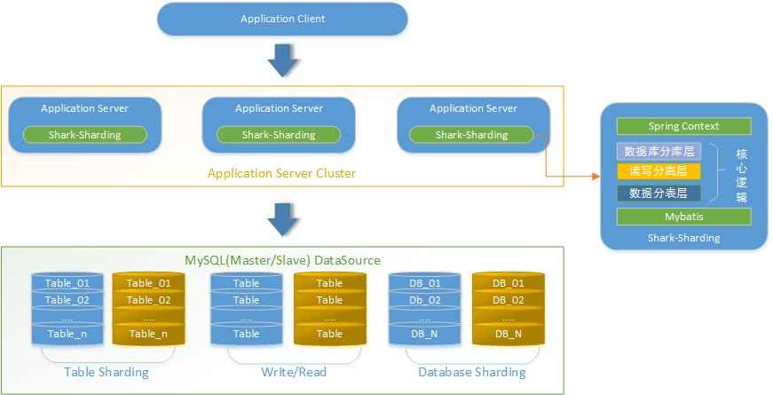

# shark-shrding
Shark Sharding 是基于 Spring MyBatis  Druid 的分库分表 读写分离框架。

## Shark-Sharding 总体架构
Shark-Sharding采用应用集成模式，介于应用（Spring）和数据库组件（MyBatis）之间。

## 设计思路
### matrixDataSource 复合数据源
    在 Shark-Sharding 中，matrixDataSource是数据源的集合；一组读写分离数据源、分库+读写分离数据源，在整个框架中都是以matrixDataSource存在。
    基于自定义标签，可以对matrixDataSource中每一个原子的数据源进行连接池配置。这是为了实现针对不同的读写库，配置个性灵活的连接池配置。
    matrixDataSource的概念，可以将杂乱的数据源信息进行统一。便于数据源的管理配置，同时是框架读写分离，分库的基础。

### Sharding 策略设计
    Shark-Sharding 并没有内置策略，这样的好处在于框架设计的简单，不涉及到 SQL 的解析过程，可以避免在这个过程中踩到难跳出来的坑。
    通过 RepositorySharding 和 TableSharding 注解中自定义 SpEL 表达式的解析，将分库分表的策略完全下放到业务方，业务方可以灵活的根据任何条件来进行 Shrding 策略的编写。
    在表达式中，执行 Java 静态方法，直接返回分库分表的 Sharding Key。框架寻找对应和分库数据源或者执行分表 SQL 的处理。

    
## 使用方式
## TODO LIST
[
    {
        "groupName": "数据源组名称，分库时为分库shardkey",
        "loadBalance": "读写分离 LB 策略",
        "atoms": [
            {
                "atomName":"子数据源的名称，可以重复，主要用在针对不同数据库的连接池配置",
                "host": "数据库IP",
                "port": "数据库PORT",
                "dbName": "数据库名称",
                "username": "数据库用户名",
                "password": "数据库密码",
                "params": "数据库连接参数",
                "isMaster": true
            },
            {
                "atomName":"子数据源的名称，可以重复，主要用在针对不同数据库的连接池配置",
                "host": "数据库IP",
                "port": "数据库PORT",
                "dbName": "数据库名称",
                "username": "",
                "password": "",
                "params": "",
                "isMaster": false
            }
        ]
    }
]

相关概念：
matrixDataSource：复合数据源，逻辑概念，包括所有实际的数据源信息。
matrixName：复合数据源名称
groupName：数据源组的名称，里面包含了一个数据库的数据源信息。只有一个的时候，默认为 rwds，对应单库的读写分离。如果有多个，代表分库场景，分库时为分库shardkey。
atom：实际的数据源信息。创建数据源对象是，Bean Name：matrixName+"_" + groupName + MASTER/SLAVE(index)